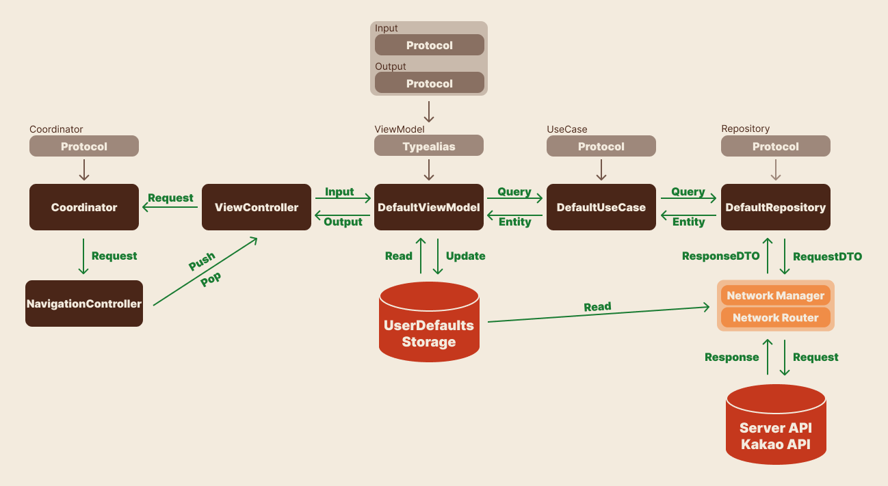
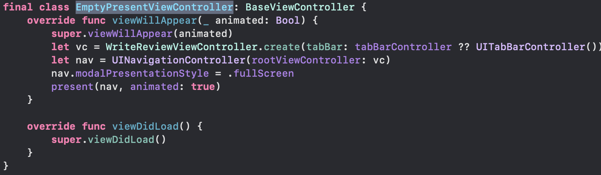

# 🍔 LookForRealBurger - 진짜 맛있는 버거를 찾아서
 

    
    
    

 

     

 
    
     
     
     
       

  

# 앱 한 줄 소개
`🍔 진짜 맛있는 햄버거를 찾기 위해 유저들과 함께 리뷰를 작성하여 지도를 채워나가는 앱`

 

# 주요기능
- 회원가입 및 로그인 인증
- 위치 기반 햄버거 맛집 확인
- 방문한 맛집에 대한 리뷰 및 평가 등록
- 다른 유저들의 리뷰 열람 및 좋아요, 댓글 작성
- 팔로우한 유저들의 리뷰 및 활동을 피드에서 확인
 

# 주요기술
- 맛집 위치 시각화: MKMapViewDelegate와 Custom Annotation을 활용한 지도 위 맛집 위치 시각화
- 간편 결제 시스템:  PG 연동 및 영수증 유효성 검증을 통해 진행되는 카드 결제 구현
- 페이지네이션 구현: 커서 기반 페이지네이션을 적용하여 무한 스크롤 시 네트워크 요청 최적화 및 성능 개선
- 이미지 업로드 및 전송: multipart/form-data를 활용한 서버 이미지 업로드 기능 구현
 

# 프로젝트 환경
- 인원
  - iOS 1명
- 기간
  - 2024.08.14 - 2024.09.01 (약 19일)
- 버전
  -  iOS 15.0 +

 

# 프로젝트 기술스택
- 활용기술
  - UIKit, Mapkit
  - MVVM-C, Input-Output, Clean Architecture
  - CodeBasedUI
  - Cursor Based Pagination
  
- 라이브러리

|라이브러리|사용목적|
|-|-|
|RxSwift|반응형 프로그래밍, 코드 가독성 향상 및 일관성 유지|
|RxCocoa|UI와 관련된 반응형 프로그래밍, 코드 가독성 향상 및 일관성 유지|
|RxDataSources|RxSwift 및 RxCocoa와 함께 일관성있는 컴포넌트 구성|
|RxGesture|RxSwift 및 RxCocoa와 함께 일관성있는 Gesture 처리|
|RxCoreLocation|RxSwift 및 RxCocoa와 함께 일관성있는 위치 데이터 관리|
|Snapkit|CodeBasedUI를 좀 더 편하고 빠르게 구성|
|Moya|추상화된 네트워크 통신 활용|
|Toast|간편한 토스트 메시지UI 구성|
|Lottie|간편하면서 적절한 애니메이션 적용|
|Tabman|간편하고 빠르게 Paging 탭바를 구성|
|iamport-ios|WebView 기반의 간편결제 적용|
|IQKeyboardManagerSwift|키보드 처리 활용|
|Kingfisher|API 이미지 처리|

 

# 앱 아키텍쳐

 
     

> MVVM(Input/Output) + Clean Architecture

설명

### 1. 계층구조
- **Coordinator** ([관련코드](https://github.com/bdrsky2010/LookForRealBurger/blob/main/LookForRealBurger/Application/AppCoordinator.swift)
    - RxSwift와 RxCocoa를 활용하여 ViewController와의 데이터 바인딩을 담당하는 계층
    - Input과 Output을 정의하여 View와 통신을 관리
    - UseCase를 통해 비즈니스 로직을 처리하고, UI 업데이트에 필요한 데이터를 제공

- **ViewModel** ([관련코드](https://github.com/bdrsky2010/LookForRealBurger/blob/main/LookForRealBurger/Scene/WriteReview/Presentation/WriteReviewViewModel.swift)
    - RxSwift와 RxCocoa를 활용하여 ViewController와의 데이터 바인딩을 담당하는 계층
    - Input과 Output을 정의하여 View와 통신을 관리
    - UseCase를 통해 비즈니스 로직을 처리하고, UI 업데이트에 필요한 데이터를 제공
    
- **UseCase** ([관련코드](https://github.com/bdrsky2010/LookForRealBurger/blob/main/LookForRealBurger/Scene/WriteReview/Domain/UseCase/UploadPostUseCase.swift)
    - 비즈니스 로직을 담당하는 계층으로, 특정 작업을 처리하기 위해 데이터를 요청 및 제공하는 역할
    - Repository를 통해 데이터를 요청 및 제공
    - 네트워크 통신 시, RxSwift의 Single trait을 활용 및 Result 타입으로 한 번 더 래핑하여 error가 발생해도 구독이 끊기지 않고 Stream이 유지되도록 구현
    
- **Repository** ([관련코드](https://github.com/bdrsky2010/LookForRealBurger/blob/main/LookForRealBurger/Common/Data/Repository/PostRepository.swift)
    - Network에 API를 요청하여 데이터를 받아오는 역할을 담당
    - 요청에 대한 데이터를 DTO로 변환하여 API에 요청
    - 응답에 대한 DTO 데이터를 Entity로 변환하여 UseCase에 전달 
    
- **Network** ([Manager 관련코드](https://github.com/bdrsky2010/LookForRealBurger/blob/main/LookForRealBurger/Common/Data/Network/LFRBNetworkManager.swift) / [Router 관련코드](https://github.com/bdrsky2010/LookForRealBurger/blob/main/LookForRealBurger/Common/Data/Network/Router/AuthRouter.swift)
    - Network Manager와 Network Router를 활용하여 실질적으로 네트워크를 담당하는 계층 
    - Network Manager: Moya의 MoyaProvider를 활용하여 네트워크 요청을 보내 응답을 받아 데이터를 반환하는 객체 
    - Network Router: Moya의 TargetType을 더 추상화한 형태의 TargetType을 새로 정의하여 채택한 enum의 case와 연관값을 활용하여 API의 BaseURL, HTTPMethod, Parameter, Header 등을 설정
    - RequestDTO와 ResposeDTO를 통해 데이터를 요청 및 응답
    
- **Data Storage** ([관련코드](https://github.com/bdrsky2010/LookForRealBurger/blob/main/LookForRealBurger/Common/Data/AccessTokenStorage/AccessStorage.swift)
    - UserDefaults를 활용하여 Local DB를 관리하는 계층
    - 간단한 데이터 저장 및 조회

### 2. 의존성 역전 원칙
> 하위 모듈을 프로토콜 타입으로서 의존성을 외부에서 주입하여 의존성의 방향을 역전시켰으며, 그로인해 유지보수성이 향상, Testable한 코드를 작성 

- DIP를 적용하기 위해 계층 간 결합도를 낮추도록 SOLID 원칙을 고려하며 모듈을 구현
    - **단일 책임의 원칙**: 역할에 따른 기능 분리로 인한 계층 모듈화 (예: 액션을 담당하는 ViewModel, 비즈니스 로직을 담당하는 UseCase, 인증에 대한 API를 담당하는 Repository 등등)
    
    - **개방-폐쇄의 원칙**: 추상화된 protocol을 채택하여 외부에서 사용되지 않는 메서드는 Class 내부에서 private하게 구현
    
    - **리스코프 치환 원칙**: 추상화된 protocol을 채택하여 해당 protocol을 따르는 모든 객체가 독립적으로 일관된 동작을 하도록 구현
    
    - **인터페이스 분리 원칙**: Input, Output, UseCase, Repository 등 역할에 따른 상위 모듈에서 사용되는 메서드 및 프로퍼티만 요구사항으로서 프로토콜에 정의
    
    - **의존성 역전 원칙**: 상위 모듈이 하위 모듈에 의존하지 않는, 추상화된 프로토콜에 의존하는 방식으로 모듈을 구현

### 3. Input/Output 패턴
- 추상화된 형태의 프로토콜로 Input과 Output을 구성하였으며, 두 프로토콜을 병합한 형태로 typealias를 통해 별칭을 ViewModel로 설정
- View에서 일어나는 액션을 Input을 통해 ViewModel에 전달
- ViewModel에서 처리된 데이터를 Output을 통해 View로 전달하여 UI를 업데이트
- Input/Output 패턴을 활용하여 MVVM 구조에서 View와 ViewModel 간에 양방향 통신에 대한 데이터의 흐름을 직관적으로 파악 및 관리 

### 4. DTO(Data Transfer Object)구조 및 데이터 흐름
> API 호출로 인한 네트워크 요청 시 요청에 필요한 데이터를 RequestDTO로 요청, 응답으로 받은 데이터를 ResponseDTO로 받으며, ResposeDTO를 Entity로 변환하여 관리
- **RequestDTO**: API 호출 시 ViewModel과 UseCase를 통해 받아온 Query 객체 데이터를 Repository 계층에서 RequestDTO 객체로 변환하여 Network Manager에 전달

- **ResponseDTO**: 서버 API로부터 전달받은 JSON 데이터를 ResponseDTO 객체 데이터로 변환 후 앱에서 사용하는 데이터의 형태로 가공된 Entity 객체 데이터로 변환하여 UseCase로 전달

- **Entity**: 앱 내 도메인 즉, 비즈니스 로직에 사용되는 데이터 객체로, ResposeDTO에서 변환된 후 UseCase로 전달되어 UI 업데이트를 위해 ViewModel로 전달

### 5. Unit Test ([관련코드](https://github.com/bdrsky2010/LookForRealBurger/blob/main/LookForRealBurgerTests/WriteReviewUnitTest.swift))
- **목적 및 설계**: Input/Output에 대한 데이터 흐름 및 API 호출에 대한 성공/실패 시나리오를 테스트

- **기대 효과**: 비즈니스 로직의 성공과 에러에 대한 핸들링에 대한 안정적인 작동 확인을 통해 신뢰성 확인

- **테스트 진행**: Mock 객체(UseCase, LocalStorge)를 통한 네트워크 통신 및 Local DB 접근을 하였으며, Protocol 타입으로 선언된 ViewModel에 실제 사용되는 ViewModel 객체를 대입하여 실질적인 Input/Output에 대한 안정적인 데이터 흐름 테스트 완료.

### 6. 아키텍쳐의 데이터 흐름 예시

 
     

 

# 구현 기술

🚩 Unit Test

### 🚩 Unit Test

프로젝트의 Unit Test 진행 중, Protocol 기반 의존성 주입으로 성공 / 실패 분기 처리가 어려웠습니다.Protocol Extenstion과 Mock 객체를 활용한 Flag 기반 분기 처리로 문제를 해결하고, 비즈니스 로직의 신뢰성을 검증했습니다.

1. **문제**
- 프로젝트의 비즈니스 로직의 신뢰성을 보장하기 위해 Unit Test를 도입했습니다.
- ViewModel의 Input / Output 액션을 검증하기 위해 UseCase를 Mock 객체로 구성하여 의존성을 주입하였으며,
- Mock 데이터로 API 요청의 성공 / 실패를 분기 처리해야 했지만, Protocol을 기반으로 의존성이 주입된 상태였습니다.
- 하지만 Protocol에 정의된 메서드로는 성공 / 실패 케이스를 분기 처리하기 어려웠습니다.
- 메서드의 재설계 없이 테스트 가능성을 확보해야 했습니다.

2. **문제 분석**
- 테스트가 불가능한 상황
    - UseCase Mock 객체에서 성공 / 실패를 제어할 수 없는 구조
- 제한사항
    - 기존 비즈니스 로직을 변경하지 않고, 테스트 환경에서만 분기처리가 필요

3. **접근 방식**
- Protocol Extenstion을 활용하여 테스트용 Flag를 추가
- Bool 값을 통해 성공 / 실패를 분기처리

4. **해결 방식**
- Protocol Extension 활용
    - 성공 / 실패를 분기 처리할 수 있는 빈 Flag Setter 메서드 Extension에서 정의
- Mock 객체에 Flag 적용
    - Protocol Extension에 정의된 Flag Setter 메서드를 Mock 객체 내부에서 구현
    - Flag를 Set 해 줄 프로퍼티 추가
    - 해당 Flag 값을 기반으로 성공 / 실패 결과를 반환하도록 로직을 구성
    - 이를 통해 기존 비즈니스 로직을 수정하지 않고, 테스트 환경에서만 분기 처리가 가능

5. **결론**

테스트 가능한 코드 구성: 기존 비즈니스 로직을 수정 없이 테스트 가능하도록 개선 완료하였습니다.

의존성 역전 원칙(DIP)를 준수했다고 해서 Testable한 구조가 보장되지는 않는다.즉, 비즈니스 로직을 설계할 때, Testability를 함께 고려해야 한다 라는 것을 알게됐습니다.다른 프로젝트에서 Unit Test를 설계할 경우, 비즈니스 로직을 처음부터 Testable한 방식으로 설계할 계획입니다.

Access Token 자동갱신

### Access Token 자동갱신

해당 프로젝트의 모든 API(게시물, 팔로잉/팔로우 등등)는
 
로그인 API를 통해 발급받은 Access Token을 요구한다.

이 Access Token의 유효 시간은 약 5분으로 짧았는데
 
그로 인해 사용자는 계속 Access Token이 만료되는 문제를 직면하게 된다.

이 문제를 해결하기 위해 두 가지 방법을 고민하게 되었다.
1. Access Token이 만료될 때마다 재로그인을 하는 방식
2. Refresh Token을 통해 Access Token을 자동으로 갱신하는 방식

 
     

이 두 방식이 고민이 됐던 이유는 Access Token을 갱신하는데 필요한 Refresh Token도 만료되는 경우 다시 
 
로그인을 해야하기 때문에 바로 재로그인을 하는 것이 어떨까 라는 고민을 했던 것이다.

그렇다면 이 부분에서 또 고민을 해야했던 부분이 두 가지가 더 존재했다.
1. 직접 로그인 방식: Access Token이 만료될 때마다 사용자가 직접 로그인하게 한다면 사용자의 경험이 매우 나빠질 것이다.
2. 자동 로그인 구현: 자동 로그인의 경우 유저의 아이디와 비밀번호를 저장해줘야 하지만 이를 UserDefaults인 로컬 저장소에 저장하는 것은 보안상으로 매우 위험하다고 판단이 됐다.

결론적으로, 재로그인을 하더라도 사용자가 직접 로그인을 해야하기 때문에 Access Token이 만료될 때마다 
 
재로그인을 하게 하는 것 또한 사용자에게 엄청난 불편함을 줄 수 있기 때문에
  
Refresh Token을 통한 Access Token 자동 갱신 방식을 선택하게 되었다.

결론적으로, 사용자가 직접 재로그인하는 불편함을 줄이기 위해 Refresh Token을 통한 자동 갱신 방식을 선택하였다.
 
즉, Refresh Token이 만료될 경우에만 사용자에게 재로그인을 요구함으로써 보안과 사용자 경험의 균형을 맞추게 되었다.

최종적으로 작성된 로직은 아래 코드와 같다.

 
     

 
     

하위 ViewController 모두 뷰 계층구조에서 사라지는 상황

### 하위 ViewController 모두 뷰 계층구조에서 사라지는 상황

 
     

- `TabBarController` 의 세번째 탭을 탭하게 되면 `EmptyViewContoller` 즉 빈 ViewController가 load 되고 해당 ViewController가 로드되면 Modal이 Present 되는 상황
- Modal이 Present 가 된 상황에서 뷰의 계층구조를 Xcode Hierarchy를 통해 확인해보니 하위 ViewController 모두 뷰의 계층구조에서 사라진 상황
- 그리고 위 경고 message가 Console 에 출력
- 경고 message
  -  먼저 `EmptyPresentViewController` 가 뷰의 계층구조에서 분리되었다!
  - 이 분리된 뷰컨트롤러에서 `UINavigationController` 를 Present 하는 것을 좀 아닌 것 같다.
  - 손상된 결과물이 보여질 수 있다.
  - 그러니 `EmptyViewController`가 보여지기 전에 뷰의 계층구조에 있는지부터 확인해라
  - 안그러면 먼훗날 언젠가 `hard exception`이 일어나 앱이 crash 될 수 있다.

 

 
     

 

위 경고 message를 해석한 후 `Modal`이 `Present` 되는 위치를 확인해보니
  
`viewWillAppear(_ animated: Bool)` 생명주기 메서드 내에 작성
  
해당 코드를 보며 생각해봤을 때,
  
`viewWillAppear(_ animated: Bool)` 에서 `ViewController` 를 `Present` 하게되면 뷰가 다 보여지지 않은 상태에서 `Modal`에서 보여지는`ViewController`가 계층구조에 올라가는 것이 아닐까 라는 생각이 들며
  
이러한 이유로 `EmptyViewController` 가 뷰의 계층구조에서 사라진 것이 아닌 뷰의 계층구조에 올라가기도 전에 분리가 되어 버린 것이라고 판단

 

 
     

 

그렇다면 `ViewController` 가 다 보여진 상태에서 `Modal` 을 `Present` 하게되면 해결될 것이라는 확신이 들었으며
  
`Modal` 이 `Present` 되는 코드를 `viewDidAppear(_ animated: Bool)` 내에 작성
  
그 후, 빌드해서 확인해보니 에러 message가 사라지고 뷰의 계층구조도 잘 올라가있는 것을 확인할 수 있었다.
 

> 느낀점 ViewController의 생명주기 메서드를 활용할 땐, 생각을 좀 하면서 해야겠다 라고 생각했다.

 

Pull To Refresh

### Pull To Refresh

 

 
     

 

- 전체 리뷰 게시글을 확인하는 화면에서 `Pull To Refresh` 기능을 구성해놓은 상황
- 이 기능을 내가 사용자의 입장에서 계속해서 사용해본 경험으로는 게시글이 `Refresh` 가 되고 있는 지 아닌 지 구분이 되지 않을 정도로 너무 빠르게 사라졌으며
- 이 부분이 내 입장에서는 어색함과 답답함이 느껴졌다.

 

 
     

 

- 물론 코드를 내가 그렇게 작동하도록 구현을 해놨기 때문이다.
- 즉, 데이터에 대한 패치를 요청하고 바로 Refreshing을 끝내버린 것이다.
- 그래서 API 통신이 완료되면 end Refreshing 되도록 로직을 수정해봐도 데이터 패치 속도가 빨라 애니메이션이 끝나는 시점이 거의 유사했다.

 

 
     

 

- 결국에는 `refreshing` 을 끝내라는 `Output Action` 이 일어나게 되면 `2초 Delay` 를 주고 `End Refreshing` 되도록 변경
- 물론 이건 너무 억지라고 할 수도 있지만 어쨌든 개발자도 사용자의 입장에서 생각을 해봐야 한다고 생각해봤을 때 이게 더 나은 선택이라고 느껴졌다.

 

  
    

 

- 실 기기에 빌드해 본 결과 어색함과 답답함은 해소가 되었다.

 

# 회고

[블로그 참고](https://minjae1995.tistory.com/52)

 
